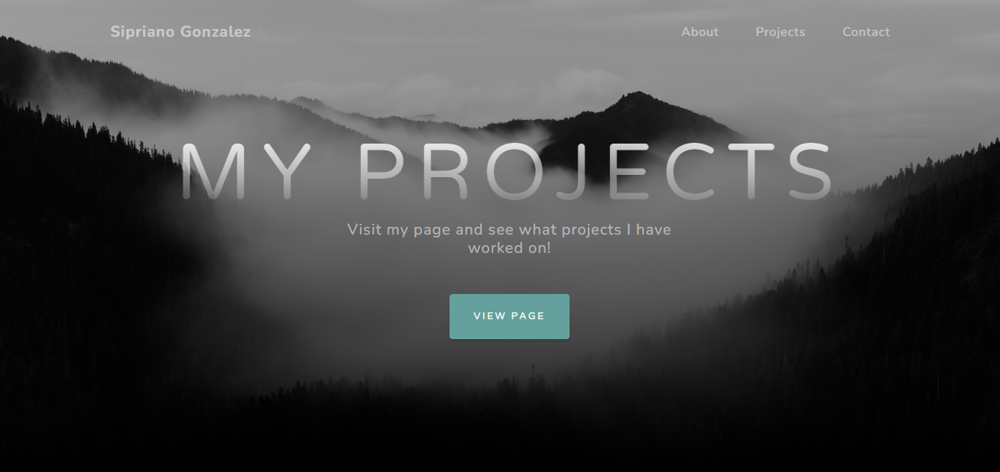

# Portfolio  

  ## Table of Contents
  -[Description](#description)
  -[Usage](#usage)
  -[Collaborators](#collaborators)
  -[Instructions](#instructions)
  -[Licenses](#licenses)
  -[Questions](#questions)

  ### Description

This is my portfolio where I have placed a few of the applications I have worked on. Feel free to follow along in my journey to learning new technologies and implementing new designs. 

Here is a screenshot of the application: 

  ### Usage
  View the deployed site using the link below:
    https://sipg789.github.io/Portunus/

  ### Collaborators
  none

  ### Instructions
  This website is a source for all of my projects and a view of who I am as a developer. 

  ### Licenses 
  Apache2.0

  ### Questions
  Feel free to contact me at:
  GitHub: "https://github.com/SipG789/Portunus"

